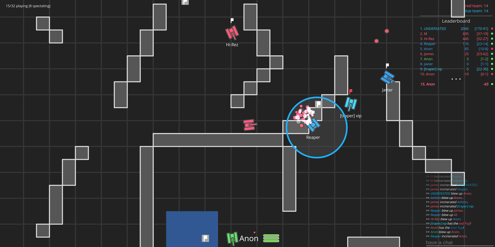

# tanqs.io

In-browser, fully multiplayer capture-the-flag built on node.js and websockets. Join the community with thousands of middle schoolers worldwide!

## Features

* No framework or game engine - just straight js with socket.io
* Authoritative server model with client-side interpolation
* Support for 32 concurrent players
* Numerous power ups
* Particle system
* "Spectator mode" follows players before you join the game

## Please note: A lot of code in this project is garbage. It was meant as a prototype and I am working on a complete rewrite.
