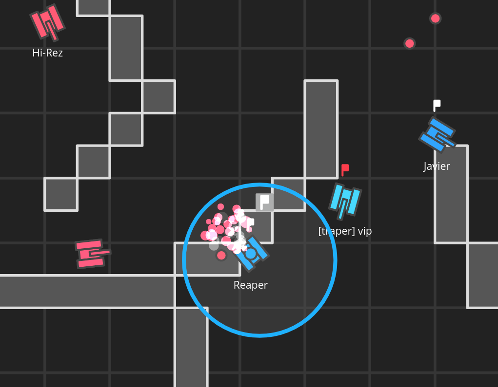

# [tanqs.io](http://tanqs.io)

In-browser, fully multiplayer capture-the-flag built on node.js and websockets. Online now with 200+ players/day.

## Features

* No game engine - just straight JavaScript with socket.io
* Authoritative server model with smooth interpolation
* Up to 32 concurrent players

* Simple mouse-only input
* A dozen power-ups to alter game play

* Clean vector graphhics with HTML5 canvas primitives
* Particle animations

* Barebones [map editor](http://tanqs.io/map.html)

## Todo for tanqs2 (in progress)

* Scaling to multiple servers
* More game modes and power-ups
* Support mobile
* Refactor engine for maintenance and extension
